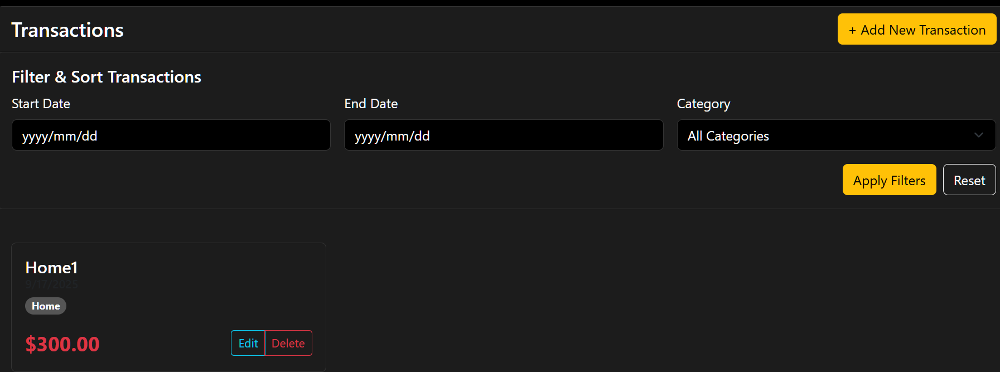

# Expense Tracker

A full-stack expense tracking application built with FastAPI (backend), Vue.js (frontend), and Docusaurus (API documentation).
<b>Live Link: https://expense-tracker-rmj6.vercel.app/</b>
## Features
- User authentication (JWT)
- Manage categories and transactions
- Filter and report on expenses
- Modern API documentation (Swagger UI & Docusaurus)


## Project Structure
```
backend/    # FastAPI backend
frontend/   # Vue.js frontend
	docs/     # Docusaurus API documentation (inside frontend)
		docs/         # Markdown docs
		static/img/   # Images for docs
		...           # Docusaurus config and build files
images/     # App screenshots for README
```
## Demo Video

[](https://youtu.be/AdSJ1ETQW6s)

Or watch here: [https://youtu.be/AdSJ1ETQW6s](https://youtu.be/AdSJ1ETQW6s)

## Screenshots

<p align="center">
	
	
</p>

## Installation

### 1. Backend (FastAPI)
```sh
cd backend
python -m venv .venv
.venv\Scripts\activate  # On Windows
pip install -r requirements.txt
```

### 2. Frontend (Vue.js)
```sh
cd frontend
npm install
```

### 3. Documentation (Docusaurus)
```sh
cd docs
npm install
```

## Usage

### Start Backend
```sh
cd backend
.venv\Scripts\activate
uvicorn main:app --reload
```

### Start Frontend
```sh
cd frontend
npm run dev
```

### Start Documentation
```sh
cd docs
npm run start
```

- Swagger UI: Visit `/api-docs` in the frontend for interactive API docs.
- Docusaurus: Visit the docs site (default: http://localhost:3000) for full API documentation.

## API Documentation
- Interactive:  API  Documentation https://itbienvenu.github.io/expense-tracker
- Human-friendly: Docusaurus docs in `frontend/docs` folder

## Contributing
Pull requests are welcome! For major changes, please open an issue first to discuss what you would like to change.


## Author
- [MWIMULE Bienvenu](https://github.com/itbienvenu)

---

